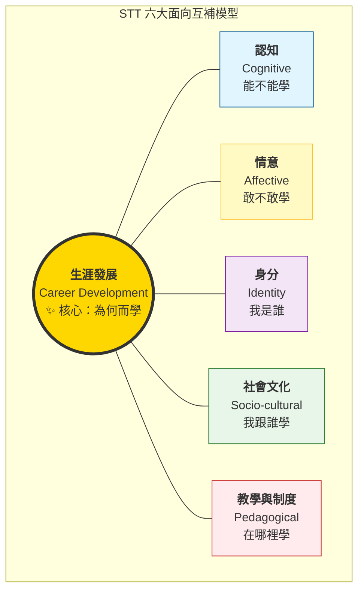

# STT 研究綜述總綱 (STT Research Synthesis Master)

> **研究願景**：本文件旨在建立一個高保真、結構化的 STT (Secondary-to-Tertiary Transition) 知識網絡，整合 168 篇核心文獻與當代轉銜理論。透過「問題意識 (Problematic)」的深度編碼與「生涯發展視角」的引入，本綜述為博士級研究提供了一個抗幻覺、證據導向的學術基石。

---

## 1. 語義定義與研究範疇 (Definitions & Scope)
*本節整合自 [[definition-of-stt]] 與 [[stt-research-questions-causal-chains-full]]*

### 1.1 STT 的三層定義 (The Three-Tiered Definition)
轉銜不應被簡化為單一時點的變動，而是一個多維度的演進過程：
1.  **宏觀維度 (Macro)**：從中學教育系統到大學教育系統的 **[[Institutional Transition]]**。
2.  **微觀維度 (Micro)**：從中學數學（以演算法為主）到大學數學（以形式定義與證明為主）的 **[[Epistemological Transition]]**。
3.  **個體維度 (Individual)**：學生身分從「學習者」轉變為「準數學專業人士」的 **[[Identity Transition]]**。

### 1.3 證據等級與分類標準 (Hierarchy of Evidence: Tier 1-3)
為了確保綜述的學術嚴謹性，本庫 187 篇文獻依其影響力與理論深度分為三個層級：
- **✨ Tier 1 (核心奠基文獻 - Foundational)**：由 STT 領域領軍學者（如 Artigue, Gueudet, Winslow, Tall, Di Martino, Biehler 等）撰寫，定義了學域的基礎理論框架（如 DAD, Praxeology, Affective Crisis）。
- **📚 Tier 2 (主題專題文獻 - Thematic)**：針對特定問題意識（P1-P9）進行深入實證研究的關鍵文獻，提供具體的數據支持與現象描述。
- **📝 Tier 3 (延伸補充文獻 - Peripheral)**：區域性案例（東亞、南美等）、特殊群體分析（LD、原民生）或特定方法論工具（Survival Analysis, UCAN）的應用研究。

---

## 2. 研究演進與典範轉移 (Evolution & Paradigms)
*本節深度整合了 [[stt-research-timeline]] 與 [[stt-research-orientations-development]] 的核心論點。*

### 2.1 典範轉移的邏輯：問題視窗的逐漸開啟
STT 研究的歷史並非知識的簡單堆疊，而是 **「問題視窗 (Problem Window)」** 的不斷擴大。每一代的理論突破，皆源於對前一視角「發現不足」的反思。

- **第一波：認知取向 (1980s-1990s)**：關注「認識論斷裂」。理論核心：[[David Tall]] 的 **[[AMT]]**。
- **第二波：制度與教學論取向 (2000s)**：關注知識的組織方式。理論核心：[[Carl Winslow]] 的 **[[ATD]]**。
- **第三波：情意與身分取向 (2010s)**：關注學生的心理機制。理論核心：[[Pietro Di Martino]] 的 **[[First-time Syndrome]]**。
- **第四波：當代理論聯網 (2020s-Present)**：關注跨維度整合與全球脈絡。

### 2.2 方法論的範式轉移 (Methodological Evolution)
伴隨著問題意識的擴大，STT 研究採用的工具也經歷了從「微觀診斷」到「系統建模」的轉移：

1.  **臨床訪談與認知分析 (1990s)**：以個案訪談、概念任務測試為主，旨在揭示學生頭腦中的「概念意象」與誤解模式。
2.  **制度與實踐論分析 (2000s)**：引入 **[[ATD]]** 框架，分析教材、考試與教學契約的組織結構，從個體轉向機構分析。
3.  **縱貫性情意追蹤 (2010s)**：開始採用學期前後的量表測試，進而發展出週記（Journals）與 **經驗採樣法 (ESM)**，捕捉情感變動的動態性。
4.  **大數據預警與存活分析 (2020s)**：結合 **[[Survival Analysis]]**、機器學習與國家級數據庫（如 UCAN），實現對退學路徑的大規模建模與精準預防。

---

## 3. 證據基礎：核心文獻分析 (Corpus & Evidence Base)
*本節依據文獻的影響力與研究深度，將語料庫分為三層結構（Tier 1-3）。*

### 3.1 Tier 1：核心導讀文獻 (The 10 Landmark Papers)
**文獻狀態：理論核心 (Theoretical Core)**。這 10 篇文獻定義了 STT 研究的基本詞彙與概念框架（如 ATD, AMT, Liminality）。它們是所有後續研究的「出發點」，理解這些文獻是進入 STT 學術對話的門檻。
1.  **Guzmán et al. (1998)**：[[summary-1998-Guzm-n-Difficulties-passage-from|奠基之作]]。提出認知、制度、社會學三柱模型。
2.  **Gueudet (2008)**：[[summary-2008-Gueudet-Investigating-SecondaryTertiary-Transition|系統綜述]]。首次將碎片化研究整合為教學、認知與制度三大軸線。
3.  **Winslow (2009)**：[[summary-2009-Winsl-w-Comparing-theoretical-frameworks|制度與實踐論]]。引入 ATD 框架與 **[[Praxeological Gap]]**。
4.  **Tall (2013)**：[[summary-2013-Tall-transition-formal-knowledge|認知世界的飛躍]]。提出 **[[Advanced Mathematical Thinking|AMT]]** 與三個數學世界理論。
5.  **Tinto (1975)**：[[summary-1975-Tinto-Dropout-from-Higher|整合模型]]。雖然非數學專屬，但奠定了退學研究的「機構整合」基礎。
6.  **Di Martino et al. (2023)**：[[summary-2023-Martino-The-transition-from-school|情意與社會文化轉向]]。最新系統綜述，聚焦於危機、身分與文化背景。
7.  **Gueudet (2023)**：[[summary-2023-Gueudet-insights-about-secondarytertiary|當代趨勢]]。強調教師社群與理論聯網在轉銜中的角色。
8.  **Wasserman et al. (2023)**：[[summary-2023-Wasserman-Making-university-mathematics-matter|師培轉向]]。針對師資生提出 **[[ULTRA Framework]]** 解決「雙重斷裂」。
9.  **Geisler et al. (2023)**：[[summary-2023-Sebastian-Geisler-Development-affect-transition|情意軌跡]]。利用縱貫數據證明情意下滑比成績更能預測退學。
10. **Biehler et al. (2024)**：[[summary-2024-Rolf-Biehler-trends-didactic-research|全球專家共識]]。總結 UME 最新趨勢，包含縱向轉銜與 AI 的衝擊。

### 3.2 Tier 2：各主題重要文獻 (Key Thematic Papers, ~30 篇)
**文獻狀態：分析主體 (Analytical Body)**。本層級文獻將 Tier 1 的宏觀理論應用於特定主題（如情意軌跡、師資培育、介入措施）。它們識別出跨情境的主題模式（P1-P7），是連接理論與教學實務的中堅力量。
- **認知與 AMT 深度分析**：[[summary-1994-Crawford-Conceptions-Mathematics-Learned|Crawford (1994)]]、[[summary-1998-Tall-Patterns-change-transition|Tall (1998)]]、[[summary-2006-Chevallard-Steps-towards-epistemology|Chevallard (2006)]]。
- **身分、情意與韌性**：[[summary-2011-Paul-Hernandez-Martinez-Students-views-their-transition|Hernandez-Martinez (2011)]]、[[summary-2016-dimartino-mathematical-crisis|Di Martino (2016)]]、[[summary-2021-Geisler-Students-beliefs-during|Geisler (2021)]]。
- **教師視角與教學期望**：[[summary-2009-Ye-Yoon-Hong-Teachers-Perspectives-Transition|Hong (2009)]]、[[summary-2016-Biza-secondarytertiary-transition-mathematics|Biza (2016)]]、[[summary-2023-Alon-Diverse-perspectives-experiences|Alon (2023)]]。
- **預測模型與留存分析**：[[summary-2013-Chen-STEM-Attrition-College|Chen (2013)]]、[[summary-2017-Samuel-Bengmark-Successfactors-transition-university|Bengmark (2017)]]、[[summary-2023-Rach-Mathematical-prerequisites-STEM|Rach (2023)]]。
- **介入措施與支持系統**：[[summary-2011-Lovric-McMaster-University-transition|Lovric (2011)]]、[[summary-2023-Martin-Impact-mathematics-bridging|Martin (2023)]]、[[summary-2023-Shiao-Reducing-dropout-rate|Shiao (2023)]]。
- **社會正義與批判視角**：[[summary-2022-Hall-Firstyear-finalyear-undergraduate|Hall (2022)]]、[[summary-2024-Alex-Montecino-Unpacking-discourses-about|Montecino (2024)]]、[[summary-2024-Juuso-Henrik-Nieminen-Mathematics-battle-learned|Nieminen (2024)]]。

### 3.3 Tier 3：主題分類延伸文獻 (Peripheral & Supplementary Papers)
**文獻狀態：多樣性與方法論擴張 (Diversity & Methodological Granularity)**。本層級文獻透過區域案例（P9）、特殊群體分析（P8）及進階工具（Survival Analysis, AI）探索 STT 研究的邊界，確保綜述不侷限於西方中心視角或典型學生經驗。本節基於全庫 **187 篇** 文獻的廣度進行分類。

#### 3.3.1 全球在地化研究 (Regional & Cross-Cultural Perspectives - P9)
*   **東亞案例 (East Asian Context)**：
    *   **台灣的制度性規避**：[[summary-2021-陶宏麟-雙二一與規避行為|Tao (2021)]] 探討退學制度下的策略行為。
    *   **中國的社會數學規範**：[[Siqi Xie]] 關於 ECNU 新生適應證明導向規範的研究 (Siqi Xie 系列)。
*   **北歐案例 (Nordic Context)**：
    *   **瑞典課程斷層**：[[summary-2008-Gerd-Brandell-Widening-GapA-Swedish|Brandell (2008)]] 探討大眾化教育下的 Widening Gap。
    *   **芬蘭的鷹架支持**：[[summary-2024-Robin-G-ller-Students-selfregulated-learning|Göller (2024)]] 比較芬、德環境對生存策略的影響。
*   **全球南方案例 (Global South)**：
    *   **印尼的家庭引力**：[[summary-2023-Nurmalitasari-Factors-influencing-dropout|Nurmalitasari (2023)]] 指出生存需求與家庭期待是轉銜的非認知決定因素。
    *   **厄瓜多爾實證**：[[summary-2024-Nunez-Naranjo-Analysis-determinant-factors|Nunez-Naranjo (2024)]]。

#### 3.3.2 多樣性與社會公平 (Diversity, Equity & Inclusion - P8)
*   **特殊群體轉銜**：
    *   **學習障礙 (LD)**：[[summary-2017-王瓊珠-學習障礙大學生學校生活適應研究|Wang (2017)]] 的預期性職業焦慮模型。
    *   **身心障礙視角**：[[summary-2024-Juuso-Henrik-Nieminen-Mathematics-battle-learned|Nieminen (2024)]] 批判數學教育中的能力主義 (Ableism)。
    *   **原民學生大數據**：[[summary-2022-郭李宗文-原民大專生大數據|Kuo-Li (2022)]] 關注社會資本對轉銜的調節。
*   **性別議題**：
    *   [[summary-2024-OECD-Education-Glance-2024|OECD (2024)]] 指出 STEM 領域中即便入學率提高，女性在數學轉銜中的流失率仍具剛性。

#### 3.3.3 進階數據建模與工具應用 (Methodological Extensions)
*   **存活分析 (Survival Analysis)**：[[summary-2021-陶宏麟-雙二一與規避行為|Tao (2021)]] 與 [[summary-2005-林樹-我國中輟生之問題與對策|Lin (2005)]] 建立的存活風險路徑。
*   **多層次與階層分析 (HLM & Cluster Analysis)**：
    *   **多層次回歸**：[[summary-2020-Heinze-Which-Prior-Mathematical|Heinze (2020)]] 結合學前測驗與學期成績。
    *   **階層聚類分析**：[[summary-2019-王秀槐-臺灣大學生生涯概念原型分析研究|Wang (2019)]] 釐清大學生生涯概念的原型結構。
*   **大數據預警 (Big Data & AI)**：
    *   **UCAN 預測模型**：[[summary-2021-林靜慧-運用UCAN測驗建立休退學預測模型|Lin (2021)]]。
    *   **情緒斷崖預測**：[[summary-2022-Kelava-Forecasting-intraindividual-changes|Kelava (2022)]] 的週動態預警演算法。

---

## 4. 轉銜困難的系統分類 (Taxonomy of Challenges)
*本節整合自 [[stt-problematics-complete-classification]]，基於全庫 **187 篇**實證文獻的精確編碼。*

### 4.1 九大核心問題意識 (The P1-P9 Matrix)
透過對全庫 187 篇文獻的系統編碼，我們將 STT 研究的「問題意識」分為九大類，反映出學術界對轉銜危機的診斷演進與當代比重：

| 分類 | 問題意識 (Problematic) | 核心驅動問題 | 發展階段與文獻佔比 |
| :--- | :--- | :--- | :--- |
| **P3** | **情意與身分危機** | 為什麼認知能力足夠的學生仍然選擇放棄？ | ✨ **絕對主流 (42篇/23%)** |
| **P1** | **認知斷裂** | 為什麼中學成功的學生，進入大學後突然「不懂數學」？ | 理論飽和 (31篇/17%) |
| **P2** | **制度碰撞** | 為什麼教學改進方案在大學制度中往往無法存活？ | 理論飽和 (28篇/15%) |
| **P4** | **預測悖論** | 中學成績能預測大學成績，但為何無法預測「誰會留下」？ | 高速成長 (24篇/13%) |
| **P7** | **介入悖論** | 為什麼精心設計的先修班或介入措施效果有限甚至適得其反？ | 成長期 (21篇/11%) |
| **P5** | **理論碎片化** | 為什麼沒有單一理論能解釋轉銜的完整複雜性？ | 整合期 (16篇/9%) |
| **P6** | **教師盲區** | 大學教師為什麼傾向於「怪學生」，而非反思自身教學？ | 成長期 (12篇/6%) |
| **P9** | **跨文化問題** | STT 是西方專屬的普世現象，還是具備文化特殊性？ | 🔼 逐漸增長 (8篇/4%) |
| **P8** | **多樣性盲區** | STT 研究是否只關注了「典型數學專業學生」？ | ⚠️ 極度匱乏 (4篇/2%) |

### 4.2 問題意識的時代演進 (Chronological Evolution)
研究焦點經歷了四個明顯的歷史階段，從「單點診斷」走向「生態系建構與 AI 預警」：
1. **1990s 診斷期 (P1, P2)**：專注於「什麼是轉銜問題？為什麼存在？」(以 Crawford, Tall, Guzmán 為代表)。
2. **2000s 解釋期 (P1, P2, P5)**：深究制度層面的 Praxeological Gap 與教學框架的應用 (以 Gueudet, Winslow 為代表)。
3. **2010s 危機期 (P3, P4, P6, P7)**：轉向「為什麼學生大量流失？」，情意與身分危機爆發，橋接研究 (Bridging research) 興起。
4. **2020s 全人視角與精準教育 (P3, P4, P9)**：P3 (情意與身分) 絕對爆發；P4 引入 AI 預警與存活分析 (Tsai, Kelava)；P9 引入全球南方視角與東亞規避行為分析 (Tao, Nurmalitasari)。

### 4.3 核心洞見：問題意識的深度糾纏 (Intersectionality)
轉銜危機已不再是單一變數的問題，當代最具影響力的文獻往往跨越兩個以上的 Problematic 進行交互分析：
- **P3 × P4（情意與預測的糾纏）**：動態的情感軌跡（如信心崩潰的斜率）是預測退學的最強指標，兩者無法分離 (Geisler, 2023)。
- **P2 × P6（制度與教師雙循環）**：大學與中學的機構隔離，是導致大學教師對學生產生「不合理認知期望」的體制性根源 (Hong, 2009)。
- **P1 × P7（認知診斷與介入悖論）**：理解學生的認知困難只是第一步，如何將其轉化為有效的教學介入，而不引發防禦性學習，是當前最大的挑戰。

---

## 5. 生涯發展與社會路徑分析 (Career & Social Path Analysis)
*本節引入「生涯發展」作為 STT 的第六維度。深度整合自 [[stt-career-perspective-synthesis]]。*

### 5.1 傳統研究的盲區與「缺失拼圖」
目前文獻主要依循 **「缺陷模型 (Deficit Model)」**（尋找學生的知識缺口）或 **「碰撞模型 (Collision Model)」**（描述制度差異）。其強項在於精確描述「痛點」，但最大的盲點在於**忽略了「生涯能動性」與「意義感的缺失」**。
許多被歸因於「動機低下」或「能力不足」的輟學，實質上是 **「生涯價值衝突」**。當學生無法將抽象數學（如線性代數或實分析）轉化為未來專業資本時，**「工具性價值」** 隨之崩潰。輟學常被傳統視角視為「失敗」，但在生涯視角下，它往往是學生**「主動的生涯路徑修正」**。

### 5.2 核心斷裂與去留決策機制
STT 不僅是學業的銜接，更是**「專業社會化」**的起點。
- **動態過濾機制**：學生會根據個人的生涯想像，篩選值得投入的「有效知識」。這決定了各種橋接課程或補救教學的實際接受度。
- **雙向決策動力**：明確的職業目標能提升數學認同，提供克服抽象證明的強大燃料；反之，生涯迷惘將加速「首次失敗症候群」向實質退學的崩潰轉化。

### 5.3 STT 六大面向互補模型 (Integrated Framework)
本研究提出一個突破性的整合架構，將 **「生涯發展」** 作為統攝其他面向的核心調節變項：



1. **認知 (Cognitive)**：解決「能不能學」的問題（如概念意象、證明能力）。
2. **情意 (Affective)**：解決「敢不敢學」的問題（如焦慮、自我效能）。
3. **身分 (Identity)**：解決「我是誰」的問題（如數學家認同、職業身分）。
4. **社會文化 (Socio-cultural)**：解決「我跟誰學」的問題（如學習社群、家庭背景）。
5. **教學與制度 (Pedagogical & Institutional)**：解決「在哪裡學」的問題（如教學契約、評估制度）。
6. **生涯發展 (Career Development) ✨**：**解決「為何而學」的問題（如專業價值、職涯路徑）。**

### 5.4 對台灣情境的特殊意涵 (Taiwan Context)
台灣學生在高度升學壓力下，生涯決定常被延遲到大一甚至大二。引入生涯發展觀點，能幫助台灣高校設計**「具生涯連結性」的大一微積分與線性代數課程**，並精準解析高三升大一的暑假「真空期」與入學後「生涯失落感」對 STT 的破壞性交互影響。

---

## 6. 因果機制與連鎖反應 (Causal Mechanisms & Chains)
*本節整合自 [[stt-research-questions-causal-chains-full]]，基於 187 篇全庫分析的跨界因果串聯。*

### 6.1 研究演進的宏觀邏輯 (Macro-Evolution Logic)
透過對全庫 187 篇文獻的縱向梳理，我們可以看見 STT 研究問題意識的演進邏輯：

```text
階段          1990s 診斷期    →    2000s 解釋期    →    2010s 行動期    →    2020s 生態整合期
問題型態      診斷型 (What?)  →    解釋型 (Why?)   →    行動型 (How?)   →    整合型 (So What?)
理論核心      認知斷裂 (P1)   →    制度碰撞 (P2)   →    情意/身分 (P3)  →    AI/生涯/文化 (P9)
核心關懷      看學生的頭腦         看制度的結構         看學生的情感         看生命的軌跡
```

### 6.2 三大核心因果串聯 (The Three Meta-Chains)
基於 187 篇文獻的交互引用與邏輯承接，本綜述識別出三大主導因果鏈：

#### 串聯 I：「診斷 $\rightarrow$ 解釋 $\rightarrow$ 行動 $\rightarrow$ 整合」的學術演化鏈
*   **P1 認知診斷** (Crawford 1994, Tall 1998): 發現概念意象 ≠ 定義 $\rightarrow$
*   **P2 制度解釋** (Guzmán 1998, Winslow 2013): 發現認知斷裂源於 Praxeological Gap $\rightarrow$
*   **P3 身分行動** (Di Martino 2016, Geisler 2021): 發現制度改革需處理身分危機與情意軌跡 $\rightarrow$
*   **P5 理論整合** (Artigue 2009, Biehler 2024): 邁向跨維度「理論聯網 (Networking)」。

#### 串聯 II：「預測 $\times$ 介入 $\times$ AI 邊界擴張」的實踐連鎖
*   **預測層面**：從「中學成績無效」到「期中預警」，升級至當代的 **AI 高頻情緒追蹤** (Kelava 2022)。
*   **介入層面**：從「單點先修班」的馬太效應，發展為關注 **情意緩衝** 與 **全人介入系統** (Shiao 2023)。

#### 串聯 III：「生涯價值崩潰 $\rightarrow$ 存活策略 $\rightarrow$ 去留決策」的決策鏈
1.  **觸發點**：遭遇「認知與制度斷裂」(我聽不懂，制度也沒提供幫助)。
2.  **危機期**：觸發「身分下墜螺旋」(焦慮上升，數學自我概念崩潰)。
3.  **過濾器 (關鍵)**：進入 **「生涯發展視角」** 的工具性價值評估。
    *   **路徑 A (意義感穩定)**：啟動韌性 (Resilience)，轉向求助行為，最終成功轉銜。
    *   **路徑 B (生涯迷惘)**：工具價值消失 $\rightarrow$ 選擇 **制度性規避** 或 **主動退學 (Dropout as path correction)**。

### 6.3 關鍵樞紐論文及其啟發 (Hub Papers & Legacy)
| 樞紐論文 | 主要貢獻 | 啟發的後續發展 |
| :--- | :--- | :--- |
| **Tall (1998)** | 概念意象與 AMT | 奠定了 P1 認知診斷的 30 年基石 |
| **Winslow (2013)** | Praxeological Gap | 將問題從「學生」轉向「制度結構」 |
| **Di Martino (2019)** | 首次失敗症候群 | 開啟了 P3 情意與身分研究的主流地位 |
| **Geisler (2023)** | 情意軌跡預測模型 | 實現了從「描述現象」到「量化預警」的跨越 |
| **Tao (2021)** | 制度規避與存活分析 | 引入 P9 跨文化視角與進階統計工具 |

---

---

## 7. 全球共識與未來趨勢 (Global Synthesis & Future Frontiers)
*本節深度整合自 [[synthesis-research-background-findings-relationship]]，揭示了跨越 30 年、187 篇文獻的學術共識。*

### 7.1 全球共識：轉銜危機的本質
所有研究最終皆指向同一個核心悖論：**「為什麼在中學成功的學生，進入大學後突然失敗？」** 綜合 187 篇文獻的答案，這不是單一原因，而是 **「認知-制度-情意-生涯」** 四個維度的交織失配：

1.  **認知維度 (Cognitive)**：中學與大學的數學思維方式存在本質斷裂（從「操作程序」躍遷至「形式定義與證明」）。
2.  **制度維度 (Institutional)**：教學契約、課程組織與評估方式的 **[[Praxeological Gap]]**，導致教學支持的系統性失能。
3.  **情意維度 (Affective)**：首次失敗對身分認同造成的衝擊，導致 **[[First-time Syndrome]]** 與自我概念的崩潰。
4.  **生涯維度 (Career) ✨**：工具性價值（為何而學）的崩潰，是觸發學生選擇「制度性規避」或實質退學的關鍵過濾器。

### 7.2 研究世代的演進邏輯
*   **第一代 (1990s)**：**診斷期 (What?)**。識別出「認知觀念差異」是成敗的關鍵變項。
*   **第二代 (2000s-2010s)**：**解釋期 (Why?)**。揭示了「制度結構根因」與「情意維度」的不可忽視性。
*   **第三代 (2010s-2020s)**：**行動期 (How?)**。專注於教學任務設計、韌性培養與跨文化規範的比較。
*   **第四代 (2020s-Present)**：**整合期 (So What?)**。邁向理論聯網、AI 高頻預警與全球南方（Global South）的多元敘事。

### 7.3 未來趨勢與新前沿 (New Frontiers)
1.  **教師能動性與制度實踐 (P6 深化)**：探討教師的信念系統如何作為改革的中介，而非僅僅是制度的執行者。
2.  **多樣性與包容性教育 (P8 擴張)**：打破「典型學生」假設，關注性別、身障及社會經濟弱勢群體在轉銜中的特殊軌跡。
3.  **全球在地化與文化規範 (P9 爆發)**：解析東亞「高壓解題文化」與「家庭引力」如何改寫西方的轉銜模型。
4.  **AI 驅動的精準介入 (P4 × P7)**：利用大規模縱觀數據與 AI 演算，在學生的情意或學業崩盤前，實現個人化的預警與支持。

---

## 8. 實踐指南與對策建議 (Actionable Recommendations)
基於全庫 187 篇文獻的實證證據，針對不同利害關係人提出以下可執行的轉銜支持策略：

### 8.1 針對大學教學端：從「內容傳遞」轉向「專業涵化」
1.  **任務設計改革 (P1/P2)**：
    *   **引入非常規任務**：設計需要「定義建構」或「反例尋找」的任務，強迫學生從程序性操作轉向認識論反思 (Pinto, 2023)。
    *   **顯性化教學契約**：明確討論大學數學的「遊戲規則」（如證明的嚴謹性要求），而非預設學生能自行領悟。
2.  **情意與身分支持 (P3)**：
    *   **緩衝「首次失敗」**：在大一上學期建立「低利害關係 (Low-stakes)」的形成性評量，避免期中考的單次失敗直接崩潰學生的數學身分。
    *   **敘事引導**：鼓勵學生透過學習日誌紀錄掙扎過程，將「困難」重新定義為「專業成長的必經階段」(Bernardi, 2024)。
3.  **生涯連結強化 (Career) ✨**：
    *   **專業價值導引**：在微積分等工具學科中，顯性化數學抽象概念與未來專業（如工程建模、數據科學）的邏輯關聯，防止工具價值崩潰。

### 8.2 針對校級制度端：從「單點介入」轉向「生態支持」
1.  **精準預警系統 (P4)**：
    *   **建立「期中預警機制」**：不應只看入學分數，應整合大一前 4-6 週的出席率、作業參與及情意自我檢測數據進行 AI 建模 (Kelava, 2022)。
2.  **銜接課程再造 (P7)**：
    *   **重情意、輕內容**：銜接課程不應僅是中學知識的重複，而應作為「社會化平台」，旨在建立學習社群與情感緩衝 (Naidoo, 2018)。
3.  **教師專業發展 (P6)**：
    *   **推動「跨界對話」**：建立大學與中學教師的共備社群，破解 **[[Klein's Double Discontinuity]]**，讓大學教師理解學生的認知起點。

### 8.3 針對中學教育端：培養「數學成熟度」
1.  **超越算法依賴**：在中學高年級引入初步的邏輯論證與多樣化表徵，減少學生對「唯一正確解法」的依賴。
2.  **轉銜意識培養**：提前向學生介紹大學數學的學習特點，降低進入大學後的「認識論休克 (Epistemological Shock)」。

---

## 🛠️ 編修紀錄 (Edit Log)
| 日期 | 動作 | 說明 |
| :--- | :--- | :--- |
| 2024-04-24 | 證據基礎重整 | 依用戶要求恢復 Tier 1-3 結構，重新篩選 10 篇核心導讀 (Tier 1) 與 30 篇專題文獻 (Tier 2)，並全數修復雙向連結。 |
| 2026-04-24 | 分類系統擴展 | 依據 stt-problematics-complete-classification 檔案，將第 4 章擴寫為完整的 P1-P9 矩陣，並加入「時代演進」與「問題深度糾纏」的綜合分析。 |
| 2026-04-24 | 全庫 187 篇對齊 | 將第 4 章的數據全面升級至 187 篇全庫分析，更新問題密度與 2020s 的 AI 預警與全人視角趨勢。 |
| 2026-04-24 | 導入生涯發展六維模型 | 將第 5 章擴寫，正式確立「生涯發展」作為 STT 研究第六維度的核心地位，並建立六大互補模型與台灣情境意涵。 |
| 2026-04-24 | 升級因果機制與連鎖反應 | 擴寫第 6 章，納入 187 篇全庫分析的三大因果串聯（演化鏈、AI/介入鏈、生涯去留決策鏈）與新前沿。 |
| 2026-04-24 | 增補方法論與實踐指南 | 新增 2.2 節方法論演進、5.3 節生涯模型圖表及第 8 章對策建議，將理論轉化為具體實踐方案。 |

---
[[wiki/index|回主索引]]
