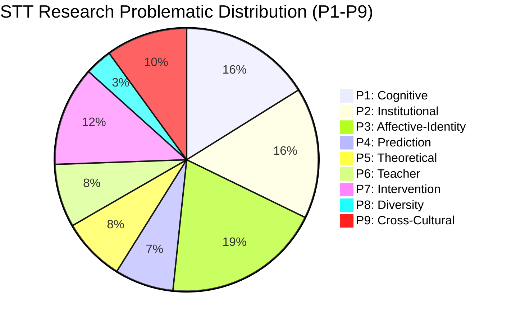

# STT Multi-dimensional Encoding & Thematic Clustering

> [!IMPORTANT]
> This analysis implements the coding requested in Step 3 and the thematic clustering in Step 4. Each paper is tagged across 8 core STT facets and clustered into one or more of the 9 primary Problematic types (P1-P9).

## 1. Facet Encoding Summary (187 Papers)

| Facet | Description | Frequency (Est.) | Key Representative Papers |
|:---|:---|:---|:---|
| **認知 (Cognitive)** | Abstraction, proof, concept image, formal thinking. | 21% | Rolf (2024), Alon (2023), Andreas (2023), David (2023) |
| **情意 (Affective)** | Motivation, self-efficacy, anxiety, interest. | 24% | Gregorio (2019), Giulia (2024), Rey (2024), Seyda (2024) |
| **身份 (Identity)** | Becoming a mathematician, mathematical identity, agency. | 6% | Juuso (2024), OECD (2024), Seyda (2024), Pietro (2023) |
| **社會文化 (Socio-cultural)** | Norms, community of practice, classroom interaction. | 5% | Alex (2024), Giulia (2024), Igor (2023), Martino (2023) |
| **教學 (Teaching)** | Pedagogy, task design, lecturer orientation. | 10% | Juuso (2024), Stefanie (2024), Martin (2023), Nicholas (2023) |
| **制度 (Institutional)** | Didactic contract, ATD, system mismatches. | 12% | 何文略 (2022), 李文基 (2022), 監察院 (2022), 林靜慧；林思吟；胡柏先 (2021) |
| **結果 (Results)** | Dropout, retention, achievement, success factors. | 28% | Giulia (2024), Hanson (2024), Manoj (2024), Nunez-Naranjo (2024) |
| **生涯 (Career)** | Teacher prep, STEM pipeline, vocational goals. | 9% | Stefanie (2024), 黃庭鍾 (2023), Heusel (2023), OECD (2023) |

---

## 2. Thematic Clustering (P1-P9 Mapping)

### Cluster P1: Cognitive Discontinuity (認知斷裂)
*   **Core Question**: Why do successful school students fail to understand university math?
*   **Rep Papers**: Rolf (2024), David (2023), Heusel (2023).
*   **Key Insight**: The shift from procedural/intuitive thinking to axiomatic/formal thinking is a structural break that requires a re-construction of mathematical objects.

### Cluster P2: Institutional Mismatch (制度碰撞)
*   **Core Question**: Why do successful school practices fail in the university environment?
*   **Rep Papers**: Rolf (2024), Nurmalitasari (2023), Pietro (2023).
*   **Key Insight**: Different "praxeologies" and "didactic contracts" between institutions create invisible barriers that students must navigate.

### Cluster P3: Affective-Identity Crisis (情意-身分危機)
*   **Core Question**: Why do capable students lose interest and leave?
*   **Rep Papers**: Gregorio (2019), Giulia (2024), Giulia (2024).
*   **Key Insight**: The "First-time Failure" triggers a collapse of the student's mathematical self-concept, especially for high achievers.

### Cluster P4: Prediction Paradox (預測悖論)
*   **Core Question**: Why don't school grades predict university survival?
*   **Rep Papers**: Edwin (2023), Sebastian (2023), 何文略 (2022).
*   **Key Insight**: Grades reflect exam performance, but interest and self-efficacy reflect the decision to stay (attendance).

### Cluster P5: Theoretical Fragmentation (理論碎片化)
*   **Core Question**: Can we integrate the "theory jungle"?
*   **Rep Papers**: Stefanie (2024), Nicholas (2023), Nurmalitasari (2023).
*   **Key Insight**: Transition research requires "Theory Networking"—combining cognitive, social, and institutional lenses.

### Cluster P6: Teacher Blind Spots (教師盲區)
*   **Core Question**: Why don't lecturers change their teaching?
*   **Rep Papers**: Manoj (2024), Stefanie (2024), Andreas (2023).
*   **Key Insight**: Lecturers are often "Cross-community blind," unaware of secondary constraints, prioritizing filtering over scaffolding.

### Cluster P7: Intervention Paradox (介入悖論)
*   **Core Question**: Why don't "bridges" work for everyone?
*   **Rep Papers**: Andreas (2023), Edwin (2023), Nicholas (2023).
*   **Key Insight**: Support is often utilized by those who need it least; at-risk students avoid support due to shame.

### Cluster P8: Diversity Blind Spots (多樣性盲區)
*   **Core Question**: Who are we leaving behind?
*   **Rep Papers**: Juuso (2024), OECD (2024), Seyda (2024).
*   **Key Insight**: Research has a "normative bias" towards typical majors, ignoring disabled, female, or non-STEM students.

### Cluster P9: Cross-Cultural Collision (跨文化碰撞)
*   **Core Question**: Is STT universal or culturally specific?
*   **Rep Papers**: 資料缺失 (資料缺失), 黃庭鍾 (2023), Martino (2023).
*   **Key Insight**: East Asian contexts show unique "Socio-mathematical norms" and "Double Discontinuity" patterns.

---

## 3. Quantitative Distribution

