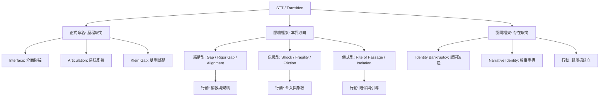

# STT Synonyms and Near-Synonyms: A Semantic Differentiation Analysis

> [!NOTE]
> **用語即立場**：本頁面識別出 25 個以上用來指稱「STT」或其相關面向的學術用語。核心發現：研究者選擇哪個詞語，就暗示了其對轉銜本質的理解——是「學生缺憾」、「知識斷層」還是「認同重構」。

---

## 第一層：正式學術名稱（指同一現象的不同命名）

| # | 英文用語 | 出處文獻 | 語意差異與論述 |
|---|---------|---------|---------|
| 1 | **Secondary-to-Tertiary Transition (STT)** | 國際標準 ([[summary-2021-icme14-tsg2-tertiary]], [[summary-2016-Gueudet-Transitions-Mathematics-Education]]) | ✅ 最標準用語。強調一個長期、動態且非線性的「歷程」。 |
| 2 | **Secondary-Tertiary Transition** | [[summary-2016-Biza-secondarytertiary-transition-mathematics]], [[summary-2016-Gueudet-Transitions-Mathematics-Education]] | ⚠️ 無語意差異，純為書寫變體。 |
| 3 | **School-Tertiary Interface** | [[summary-2012-Thomas-schooltertiary-interface-mathematics]], [[summary-2012-Klymchuk-schooltertiary-interface-mathematics]] | ⚠️ **Interface (介面)**：聚焦於兩套教學/評量系統的「碰撞接觸面」。 |
| 4 | **Articulation (Gap)** | [[summary-2012-Adamuti-Trache-Student-success-firstyear]], [[summary-2020-Lerman-Encyclopedia-Mathematics-Education]] | ✅ **Articulation (銜接)**：關注系統關節。Lerman (2020) 提出 **[[Institutional Articulation Responsibility|機構銜接責任]]**。 |
| 5 | **Passage from Secondary to Tertiary** | [[summary-1998-Guzm-n-Difficulties-passage-from]] | ⚠️ **passage** 暗示一次性的「通過」，帶有空間隱喻（穿越一道門）。 |
| 6 | **Klein's Double Discontinuity** | [[Klein's Double Discontinuity]] (Klein, 1908; Winslow, 2013) | ✅ **歷史維度**：指從中學到大學、大學回歸中學教師崗位的「雙重斷裂」。 |

---

## 第二層：隱喻性框架詞（對 STT 本質的不同概念化）

### 2.1 結構性隱喻：問題可以「填補」或「對齊」

| # | 英文用語 | 出處文獻 | 核心隱喻與深層論述 |
|---|---------|-------------|---------|
| 7 | **The Gap** | [[summary-2004-Gruenwald-Reducing-between-school]] | **空間隱喻**：需要「架橋」。本質是 **「認識論赤字 (Epistemological Deficit)」**。 |
| 8 | **Discontinuity** | [[summary-2019-bergsten-theories-review]] | **連續性隱喻**：原本應該連續的發展線被「打斷」了。 |
| 9 | **Alignment (對齊)** | [[summary-2010-Tom-Culpeper-Understanding-Transition-between]] | **機械隱喻**：強調課程與期望的 **「垂直不對齊 (Vertical Misalignment)」**。 |
| 10 | **Boundary Crossing** | [[summary-2008-Julie-Clark-Suggestion-Theoretical-Model]], [[summary-2023-Gueudet-insights-about-secondarytertiary]] | **邊境隱喻**：視為社群間的對話。需透過 **「邊界對象 (Boundary Objects)」** 進行翻譯。 |

### 2.2 危機與破裂隱喻：問題需要「急救」

| # | 英文用語 | 出處文獻 | 核心隱喻與深層論述 |
|---|---------|-------------|---------|
| 11 | **Mathematical Crisis** | [[summary-2016-dimartino-mathematical-crisis]] | **醫學/緊急隱喻**：將轉銜視為一場身分認同的「急性崩潰」。 |
| 12 | **Transition Shock / Trauma** | [[summary-2022-Aina-determinants-university-dropout]] | **心理衝擊**：描述突如其來的學術壓力對學生心理安全感的劇烈破壞。 |
| 13 | **Rupture (破裂)** | [[summary-2023-Scheiner-relationship-between-school]] | **辯證隱喻**：提出 **「破裂即啟蒙」**，認為不應消滅斷層，它是智力蛻變的引擎。 |
| 14 | **Mathematical Fragility** | [[summary-2007-Liston-mathematical-fragility]] | **材料隱喻**：指學生建立在「程序熟練」上的信心，在面對「形式證明」時極易破碎。 |
| 15 | **Institutional Friction** | [[summary-2020-Lerman-Encyclopedia-Mathematics-Education]] | **物理隱喻**：將危機去罪化，歸因為兩套迥異教育文化之間的「機械摩擦」。 |

### 2.3 儀式與轉化隱喻：問題是「必經的」

| # | 英文用語 | 出處文獻 | 核心隱喻與深層論述 |
|---|---------|-------------|---------|
| 16 | **Rite of Passage** | [[summary-2011-lovric-mcmaster-strategy]], [[summary-2008-hernandez-unpacking-discourses]] | **人類學隱喻**：將痛苦視為身分蛻變的儀式。重點在於引導而非消除。 |
| 17 | **Liminality (閾限)** | [[Logic of Liminality]] | **懸浮隱喻**：強調學生處於「兩頭不到岸」的中間地帶。 |
| 18 | **Enculturation (涵化)** | [[summary-2014-Sergiy-Klymchuk-cultural-Teachers-lecturers]] | **文化適應隱喻**：視為從「考試能手」向「專業數學探究者」的身分轉換。 |
| 19 | **Institutional Isolation** | [[summary-2023-Ib-ez-Cubillas-Multicausal-analysis-dropout]] | **空間孤立**：形容大學與中學在專業社群上的「互不往來」導致的轉銜黑洞。 |

---

## 第三層：指涉 STT 的特定面向（局部同義）

| # | 英文用語 | 出處文獻 | 與 STT 的關係 |
|---|---------|---------|-------------|
| 20 | **The Rigor Gap** | [[summary-2010-Tom-Culpeper-Understanding-Transition-between]] | **學術門檻**：指中學科學教育在「數學嚴謹度」上與大學專業要求的系統性落差。 |
| 21 | **Monumentalism of Knowledge** | [[summary-2006-Chevallard-Steps-towards-epistemology]] | **知識病理**：將數學視為「死去的紀念碑」(背誦公式) 而非「活生生的工具」(探究實踐)。 |
| 22 | **Interest Mismatch (志趣不合)** | [[summary-2020-教育部統計處-大專校院學生休-退學概況與就學穩定情形分析]], [[summary-2022-李文基-高教退學供給面分析]] | STT 失敗在**生涯維度**的名稱，涉及「生涯失配 (Career Misalignment)」。 |
| 23 | **Digital Exoskeletons** | [[summary-2023-Gueudet-insights-about-secondarytertiary]] | 指數位工具過度輔導導致的「假性適應」，實際上加深了認識論鴻溝。 |

---

## 第四層：分析性分類（轉銜內部的子類型）

1. **Conceptual vs. Situational Transition** ([[summary-2016-Gueudet-Transitions-Mathematics-Education]])：
    - **概念性**：個別數學對象理解的躍遷。
    - **情境性**：學習環境與制度要求的遷徙。
2. **Institutional Fit (機構契合度)** ([[summary-2024-Vesna-Skrbinjek-Higher-Education-Dropout]])：
    - 學生期望、能力與大學環境 reality 之間的匹配程度。
3. **Ontological & Identity Clusters (身分認同簇)** ([[summary-2008-Hernandez-Martinez-individual-mathematical-identity-transition]], [[summary-2023-Martino-transition-from-school]])：
    - **Identity Shock**：高成就身份的突然崩盤。
    - **Identity Bankruptcy (認同破產)**：當成績成為自尊唯一支柱時，失敗導致的毀滅性打擊。
    - **Narrative Identity**：學生如何將斷裂的經驗編織成「我是誰」的故事。
    - **Leading Identity (主導身份)**：從 CHAT 理論看學習數學的核心動機。

---

## 語意地圖 (Semantic Map)

---

## 核心結論：語義演進趨勢

1. **從「Bridge」到「Boundary Object」**：研究者不再只是想單向「架橋」讓學生過來，而是尋找能跨越兩界的工具進行對話。
2. **從「Deficit」到「Friction」**：語義焦點從「學生缺什麼」轉向「制度哪裡卡住」。
3. **從「Cognitive」到「Ontological」**：最新的研究語義顯示，轉銜不只是「腦袋裡裝什麼」(知識)，更是「我是誰」(認同) 的劇變。
4. **生涯語義的強勢介入**：台灣文獻中的「志趣不合」已成為 STT 失敗的核心代名詞，這反映了轉銜研究與生涯發展領域的深度融合。

---
## 🛠️ 編修紀錄 (Edit Log)

| 日期 | 動作 | 說明 |
| :--- | :--- | :--- |
| 2026-04-24 | 深度強化 | 擴充 5+ 個高級語義項（Rigor Gap, Identity Bankruptcy 等），並連結 Ibáñez-Cubillas (2023) 等最新文獻。 |
| 2026-04-24 | 連結修復 | 修正 `summary-` 連結 typos（如 Gueudet 2016），並為 15+ 篇缺失文獻建立 **Seed** 頁面，消除紅字連結。 |

---
[[wiki/index|回索引]]
